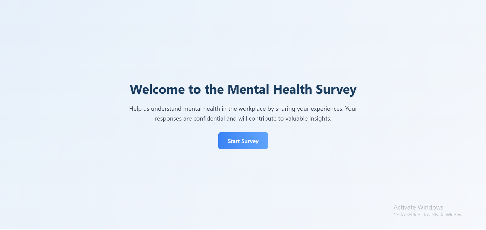

# Mental Health Prediction

## Team Members
- Sharvin Joshi
- Pritom Talukdar
- Ananya Anand
- Aryaan Ganesh

## Project Overview
This project aims to predict whether the user needs a mental health treatment or not.

## Data Preprocessing
- **Elimination of unwanted columns:** Removed irrelevant features to reduce noise and enhance model performance.
- **Handling missing values:** Ensured data completeness for consistent training.
- **Reducing number of classes:** Consolidated certain categorical variables to simplify classification.
- **Encodings:** Converted categorical data into numerical format for model compatibility.

## Model
- AdaBoost Classifier

## Evaluation Metrics
- **Confusion Matrix:** Evaluated true/false positives and negatives to understand prediction distribution.
- **ROC Curve:** Visualized model capability in distinguishing between classes.
- **Accuracy:** Measured overall correctness of the model predictions.

## Website

